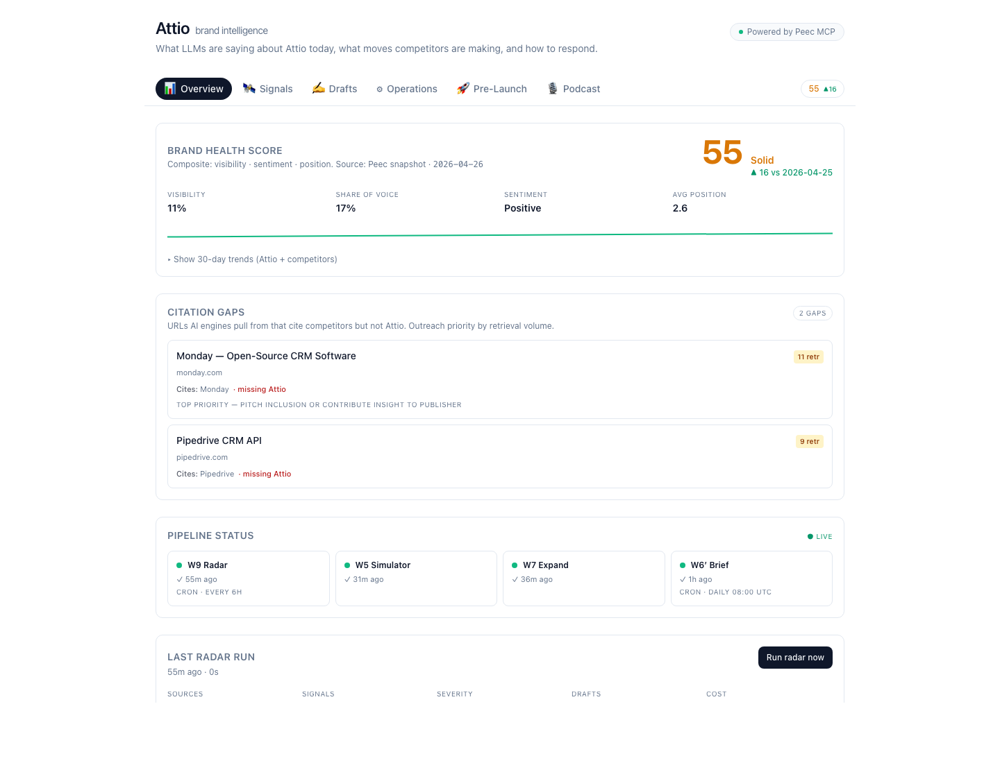
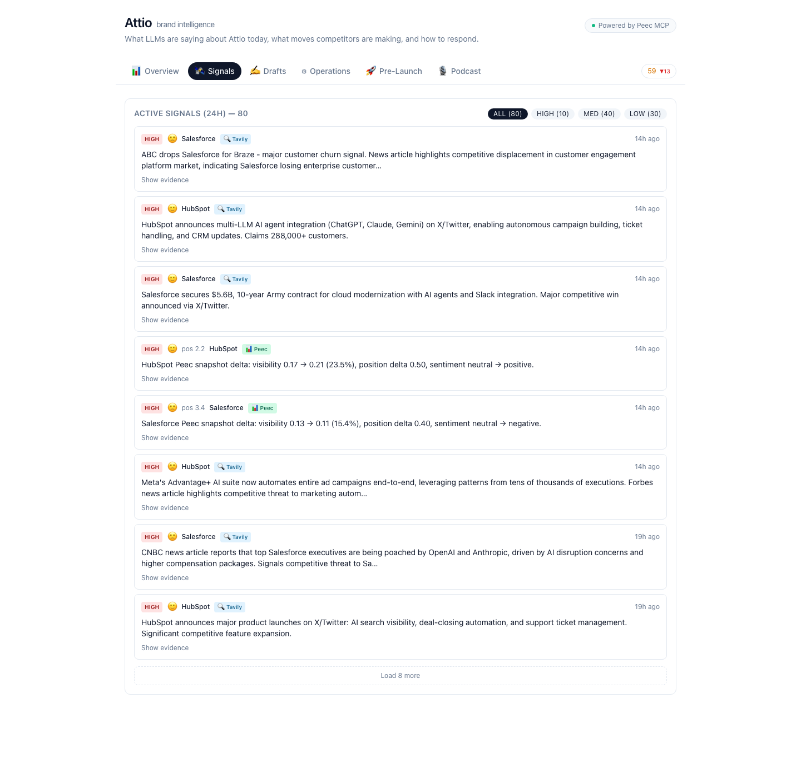
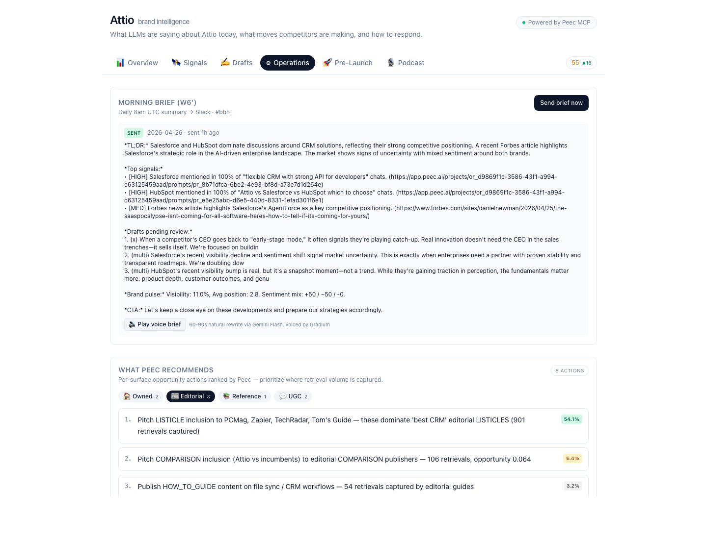
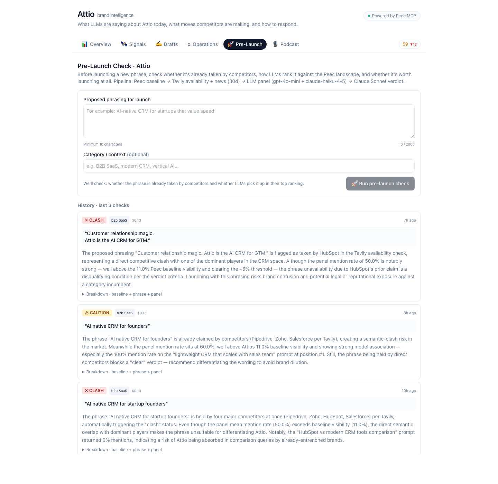
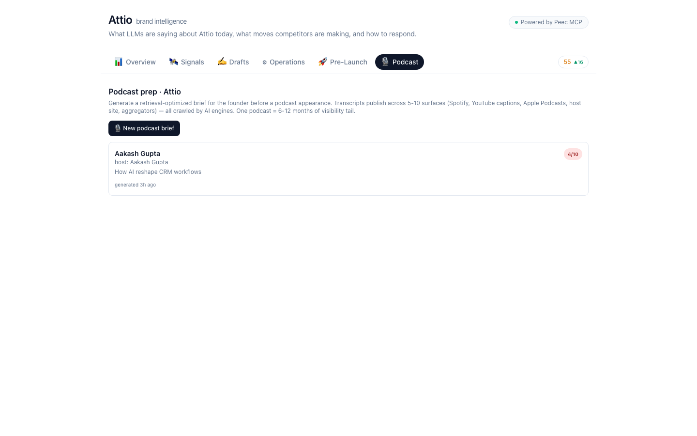

# BBH — Brand Intelligence Agent

[](https://bbh-brown.vercel.app/demo/attio)
[](https://github.com/HlibHav/BigBerlinHack/actions/workflows/ci.yml)
[](https://nextjs.org)
[](https://typescriptlang.org)
[](https://supabase.com)
[](https://inngest.com)
[](https://claude.com/claude-code)

> **Your brand is being shaped by AI models right now.** BBH monitors how LLMs describe you vs competitors, classifies the gaps, writes counter-narratives, and ships them across channels — while you sleep.

**Live demo:** [bbh-brown.vercel.app/demo/attio](https://bbh-brown.vercel.app/demo/attio) — Attio vs Salesforce & HubSpot, no login required.

Built for [Peec MCP Challenge](https://peec.ai) at **Big Berlin Hack 2026-04-25/26** · Track: Peec AI · 3 partner technologies: **Tavily + Google Gemini + Gradium** · Side challenge: **Aikido** (security)

---

## What it does

Most brands have no idea how ChatGPT, Claude, or Gemini describes them when a buyer asks *"what's the best CRM for a growing SaaS startup?"*. BBH closes that loop.

**Five automated pipelines:**

**Competitor Radar** runs every 6 hours. Pulls brand visibility data from Peec — mention rates, share of voice, sentiment, position rankings — and supplements with live Tavily news. Classifies each signal as high / medium / low severity. The marketer decides when to draft a response — auto-fan-out is intentionally off.

**Narrative Simulator** takes a competitor move or any seed prompt and generates 3–5 ranked counter-narratives. Each variant is generated by a distinct angle (data model / migration / API DX / pricing / speed / specialization), scored by a Sonnet-4.5 judge on four dimensions, then ranked. Not "here's the best answer" — here's why each one ranks differently, with a body-aware quality score.

**Multi-Channel Expand** takes one approved counter-draft and expands it into three ready-to-publish formats: long-form blog post, X thread, and LinkedIn update. Triggered automatically on approval.

**Morning Brief** sends a 200-word Slack summary every morning at 8am UTC — yesterday's signal delta, top counter-draft performance, what moved overnight.

**Podcast Prep** is our differentiation play — when the founder is invited to a podcast, BBH generates a retrieval-optimized brief: 5–7 talking points with self-rated retrievability, 6–10 anticipated host Q&A, brand-drop moments, topics-to-avoid (sourced from open high-severity signals), and per-competitor mention strategy. Why this matters: a podcast transcript publishes across 5–10 surfaces (Spotify show notes, YouTube auto-captions, host site, Apple Podcasts, aggregators), all crawled by AI engines — one episode = 6–12 months of retrievable visibility tail. Click **🔊 Preview voice** on any talking point to hear it spoken aloud (Gradium TTS) before recording.

All pipelines require human approval before anything goes public. Every artifact carries an evidence chain: Peec snapshot timestamp + source URL, so you know exactly why a recommendation was generated.

---

## Screenshots

Six tabs, each one a focused view into one part of the loop. Captured against the live deploy at [bbh-brown.vercel.app/demo/attio](https://bbh-brown.vercel.app/demo/attio) on 2026-04-26.

### Overview — Brand Health + Citation Gaps

[](docs/screenshots/01-overview.png)

Composite Brand Health Score (visibility · sentiment · position) with day-over-day delta and 7/30/90-day multi-line trend chart. Below it, **Citation Gaps** — URLs AI engines retrieve from that cite competitors but not Attio (Monday and Pipedrive surfaces shown), ranked by retrieval volume. Outreach priority list, generated automatically from Peec `url_report`.

### Signals — 24h feed with AI evidence

[](docs/screenshots/02-signals.png)

Severity-classified competitor moves filtered by HIGH / MED / LOW. Each card carries source attribution (📊 Peec delta vs 🔍 Tavily news), avg position, sentiment emoji, and an expand drawer that surfaces real AI conversations from the Peec `chats` field — the literal ChatGPT / Perplexity reply that motivated the signal.

### Drafts — counter-narratives + simulator variants

[](docs/screenshots/03-drafts.png)

Counter-drafts queue with stepper (Signal → Draft → Approve → Expand → Publish). Pending bucket holds anything still actionable — including approved drafts whose 3 channel variants are generated but not yet pushed to channels. Cards only fade and slip into «decided» once the user clicks **📤 Publish to channels** (or rejects).

### Operations — morning brief + Peec recommendations + cost ledger

[](docs/screenshots/04-operations.png)

Today's morning brief with a **Play voice brief** button (Gradium TTS plays the Gemini-rewritten plain-prose script). Below it, **What Peec recommends** — four tabs (Owned / Editorial / Reference / UGC) showing per-surface opportunity actions sorted by `opportunity_score`. Cost ledger at the bottom reports today's spend per provider.

### Pre-Launch — phrase-availability check + LLM panel

[](docs/screenshots/05-prelaunch.png)

Type a draft positioning phrase, hit **Run pre-launch check** — Tavily scans general + news web for competitor clash, an N-prompt × 2-model panel measures projected mention rate, and Sonnet 4.5 synthesizes a verdict (clear / caution / clash) with English reasoning. History list keeps every previous check.

### Podcast Prep — retrieval-optimized brief generator

[](docs/screenshots/06-podcast.png)

Founder enters podcast metadata (host, topic, scheduled date) → 11-step Inngest pipeline produces a brief with talking points, anticipated Q&A, brand-drop moments, topics-to-avoid (cross-referenced with open high-severity signals from the radar), and per-competitor mention strategy. Each item includes Sonnet 4.5 judge scores across retrievability / naturality / specificity / coverage.

---

## Stack

| | |
|---|---|
| Frontend | Next.js 14 App Router + TypeScript + Tailwind + shadcn/ui |
| Deploy | Vercel |
| Database | Supabase (Postgres + pgvector), eu-west-1 |
| Orchestration | Inngest step functions |
| Brand data | Peec MCP — AI brand visibility tracking |
| Live news + research | **Tavily** search API (radar fresh news, podcast prep previous-episode fetch, pre-launch phrase-availability) |
| LLMs | OpenAI GPT-4o (Q&A + brand drops) + Anthropic Claude Sonnet 4.5 (talking points + judge) + **Google Gemini 2.5 Flash** (podcast-prep structural sections — 10× cheaper) |
| Voice | **Gradium** TTS — preview talking points spoken aloud (podcast prep) |
| Security | **Aikido** — connected to repo for SAST + dependency scanning |
| Alerts | Slack incoming webhook |

---

## Demo walkthrough

Open [bbh-brown.vercel.app/demo/attio](https://bbh-brown.vercel.app/demo/attio) on your phone.

The dashboard shows Attio's current position across AI models vs Salesforce and HubSpot: visibility scores, sentiment, where Attio ranks when buyers ask CRM questions.

Click any counter-draft to see the evidence trail — which Peec signal triggered it, what the sentiment delta was, what sources the AI cited.

Hit **Approve** → multi-channel expand fires → four channel-ready variants appear in ~30 seconds.

Hit **Send brief now** → a real Slack message posts to the demo channel.

Hit **Run radar now** → watch the Inngest step trace live — fetch → classify → draft — a new signal appears in the feed.

---

## Local setup

```bash
pnpm install
cp .env.example .env.local   # fill in your keys
pnpm dev
```

You'll need: Supabase project (eu-west-1), OpenAI + Anthropic API keys, Tavily key, Slack incoming webhook, Inngest account.

Full setup → `brand-intel/RUNBOOK.md`.

---

## Project structure

```
app/
  demo/[brand]/     # public dashboard, no auth
  api/inngest/      # Inngest serve endpoint
  actions/          # server actions (radar, simulator, brief, counter-draft)
inngest/functions/  # competitor-radar, content-expand, narrative-simulator, morning-brief, podcast-prep, prelaunch-check
lib/
  schemas/          # Zod schemas for every LLM output boundary
  services/         # Tavily, OpenAI, Anthropic, Slack, Peec snapshot, cost ledger
  supabase/         # typed client + server clients
components/
  dashboard/        # 11 components, all sections of the demo dashboard
data/
  peec-snapshot.json  # Peec brand intelligence data (Attio, Salesforce, HubSpot)
supabase/
  migrations/       # schema + seed
```

---

## How the Peec integration works

Peec tracks how AI models respond to brand-relevant prompts daily — visibility, share of voice, sentiment, position. BBH reads a snapshot of this data (pulled via [Peec MCP](https://docs.peec.ai/mcp)) and uses it as the signal source for the competitor radar.

The snapshot lives at `data/peec-snapshot.json` and is refreshed manually. This keeps the demo fully functional without a live API dependency.

Concretely, BBH operationalizes four Peec MCP data surfaces in the dashboard:

- **`brand_reports`** → `BrandHealthHero` — composite health score (visibility · sentiment · position) with 7/30/90-day multi-line trend chart, self brand vs competitors.
- **`url_report`** → `CitationGapCard` — URLs AI engines retrieve from that cite competitors but not the own brand. Ranked by retrievals = priority earned-media outreach targets.
- **`actions`** → `PeecActionsPanel` — Peec's per-scope opportunity actions (owned / editorial / reference / ugc) with `opportunity_score`, surfaced as four tabs in Operations.
- **`chats`** → `SignalAiEvidence` — real ChatGPT / Perplexity conversations rendered inline in each Signal card's evidence drawer. Shows the literal AI response that motivated the signal, with model attribution + source list.

Every panel falls back to a friendly empty state when the snapshot is stale or doesn't contain the relevant rows for that brand.

---

## License

MIT
